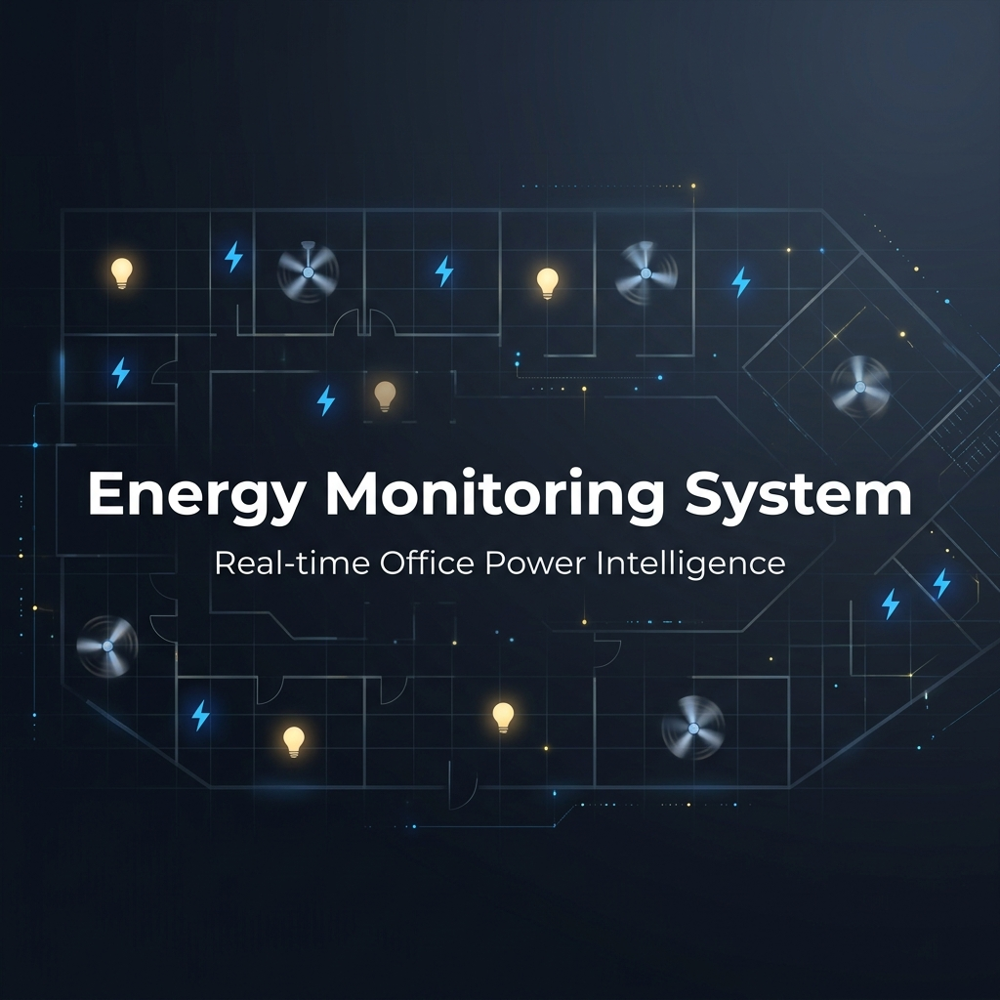
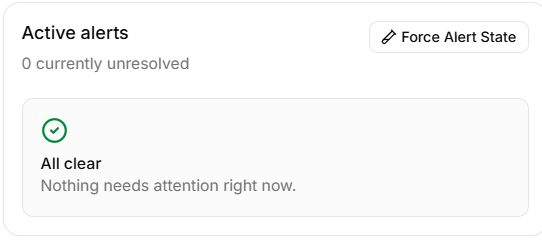

<p align="center">
  
</p>

<p align="center">
  <strong>A live office energy dashboard and Discord bot that share a single real-time backend.</strong><br/>
  Monitor every light and fan, track power consumption, and get intelligent alerts — all from your browser or Discord.
</p>

<p align="center">
  <a href="https://ems-ptsd.vercel.app/">
    
  </a>
</p>

<p align="center">
  
  
  
  
  
  
  
  
  
</p>

---

## 💡 The Problem

People keep leaving lights and fans on when they head home. The electricity bill climbs, and nobody notices until it's too late.

The fix? A system that lets anyone monitor the office's electrical devices through both a **live web dashboard** and a **Discord bot** — because some people live in their browser and others never leave Discord.

## 🏠 The Office

The office has **3 rooms**, each with the same set of devices:

| Room | Purpose | Fans | Lights | Total |
|---|---|:---:|:---:|:---:|
| Drawing Room | Waiting area | 2 | 3 | 5 |
| Work Room 1 | Employee workspace | 2 | 3 | 5 |
| Work Room 2 | Employee workspace | 2 | 3 | 5 |
| | | | **Total** | **15** |

Each device tracks: **on/off status**, **live wattage** (fans ~60W, lights ~15W), **room**, and **last state change timestamp**.

---

## ✨ Features at a Glance

| | Feature | Description |
|---|---|---|
| 🏢 | **Interactive Office Floorplan** | Top-view SVG layout with 3 rooms, desks, and chairs. Fans spin when ON, lights glow warm when ON. Updates in real time. |
| 📊 | **Live Device Status** | All 15 devices (2 fans + 3 lights × 3 rooms) with ON/OFF badges, live wattage, and last-changed timestamps. |
| ⚡ | **Power Consumption Meter** | Total office watts + per-room breakdown with percentage bars. Estimated kWh today via trapezoidal integration. |
| 🚨 | **Smart Alerts** | Detects devices left on after office hours (9 AM–5 PM) and rooms with all devices on for 2+ hours continuously. |
| 🤖 | **Discord Bot** | `!status`, `!room`, `!usage` commands with Gemini-humanized conversational responses and deterministic fallback. |
| 📢 | **Proactive Alert Posts** | Bot automatically posts to a Discord channel when alert conditions trigger — no one needs to ask. |

---

## 📸 Dashboard Preview

<table>
  <tr>
    <td colspan="2" align="center">
      
      <br/><em>Interactive office floorplan — fans spin, lights glow, tooltips show device details</em>
    </td>
  </tr>
  <tr>
    <td colspan="2" align="center">
      
      <br/><em>Device status cards — every device identified with live wattage and timestamps</em>
    </td>
  </tr>
  <tr>
    <td align="center" width="50%">
      
      <br/><em>Live power consumption + estimated kWh today</em>
    </td>
    <td align="center" width="50%">
      
      <br/><em>Per-room power breakdown with share percentages</em>
    </td>
  </tr>
  <tr>
    <td colspan="2" align="center">
      
      <br/><em>Active alerts panel — timestamped anomaly detection</em>
    </td>
  </tr>
</table>

---

## 🤖 Discord Bot in Action

The bot pulls live data from the same backend as the dashboard. Gemini rephrases the raw data into friendly, conversational responses — but never invents or alters any numbers.

**`!status`** — whole-office overview:
```
📊 Here's the current office snapshot: Drawing Room has both fans
and all 3 lights running at 163W. Over in Work Room 1, both fans
and 1 light are on, pulling 141W. Work Room 2 has both fans and
1 light going for 134W. The office total sits at 438W right now.
```

**`!room work1`** — single room detail:
```
🏢 Work Room 1: 2 of 2 fans and 1 of 3 lights are ON.
Total room power: 141W.
- Fan 1 (fan): ON, 62W, last changed 12m ago.
- Fan 2 (fan): ON, 63W, last changed 23s ago.
- Light 1 (light): OFF, 0W, last changed 5m ago.
- Light 2 (light): OFF, 0W, last changed 6m ago.
- Light 3 (light): ON, 16W, last changed 1m ago.
```

**`!usage`** — power consumption summary:
```
⚡ The office is currently drawing 438W. Estimated usage
for today so far is 1.941 kWh across all three rooms.
```

If Gemini is unavailable, the bot falls back to plain deterministic responses using the same live data — no AI required for core functionality.

---

## 🏗️ System Architecture

The web dashboard and the Discord bot share a **single Convex backend** — one source of truth for all device state, power logs, and alerts.

```
┌──────────────┐     ┌──────────────────┐     ┌──────────────────┐
│  Simulator   │────▶│  Convex Backend   │◀────│  Discord Bot     │
│  (Cron 3s)   │     │  (Source of Truth)│     │  (Gemini + HTTP) │
└──────────────┘     └────────┬─────────┘     └──────────────────┘
                              │ WebSocket
                     ┌────────▼─────────┐
                     │  React Dashboard  │
                     │  (Vite + Vercel)  │
                     └──────────────────┘
```

The full system diagram (Excalidraw) is available here: [**System Diagram →**](docs/system-diagram.svg)

### Why Convex?

Convex was chosen because it solves the hardest constraint in the problem — **real-time updates without page refresh**. The dashboard subscribes to live queries over WebSocket; when the simulator flips a device every 3 seconds, every connected client sees the change instantly. Server-side crons handle the simulation tick and alert evaluation without any external scheduler. And since both the dashboard and the Discord bot call the same query functions, there's genuinely one source of truth — not two systems duct-taped together.

### Shared Query Functions

Both the dashboard and Discord bot consume the exact same Convex queries:

| Query | Returns |
|---|---|
| `office:getAllDevices` | All 15 devices grouped by room with summary stats |
| `office:getRoomStatus` | Single room detail with human-readable summary text |
| `office:getUsageSummary` | Total watts, per-room watts, estimated kWh today |
| `office:getActiveAlerts` | Unresolved alerts, newest first |

---

## 🔌 Hardware / Electrical Schematic

This is a **concept-only** Wokwi circuit — it is not wired to the live
dashboard or bot in any way, since no physical hardware is required to run
this project. It exists to answer a separate requirement: *"if this office
actually had smart-controlled lights and fans, how would you wire and sense
them?"*

It models one representative room — **Work Room 1** (3 lights + 2 fans) —
showing an ESP32 switching each device through a relay module, plus a
current-sense tap standing in for an ACS712 sensor. The same pattern would
repeat for the other two rooms.

👉 **[Hardware schematic, sketch, and wiring notes →](docs/hardware-schematic/README.md)**
👉 **[Open live in Wokwi →](https://wokwi.com/projects/468597321072296961)**


## 🔄 How the Simulation Works

The office data is simulated entirely inside Convex — no external processes needed.

**Seeding:** The seed function creates 15 devices across 3 rooms (Drawing Room, Work Room 1, Work Room 2). Each room gets 2 fans (~60W rated) and 3 lights (~15W rated).

**Simulation tick:** A Convex cron runs `simulatorTick` every **3 seconds**. Each tick:
1. Randomly flips 0–3 devices (weighted: 55% flip none, 25% flip one, 15% flip two, 5% flip three).
2. A 5% "bias" chance turns on up to 2 devices in a random room — naturally creating sustained-usage alert conditions over time.
3. When a device turns on, its watt draw is set to its rated wattage ±5% jitter. When off, watts drop to 0.
4. Logs total watts to `powerLog` for kWh estimation.
5. Evaluates alert conditions and creates/resolves alerts.

**Alerts are auto-managed:** New alerts are deduplicated by condition. When a condition clears, the alert is resolved automatically.

### Alert Conditions

The system watches for two anomalies:

| Alert | Trigger | Example Message |
|---|---|---|
| **After hours** | Any device ON outside 9 AM – 5 PM | *"Drawing Room has 3 devices still on after office hours."* |
| **Sustained usage** | All 5 devices in a room ON for 2+ hours straight | *"All 5 devices in Work Room 1 have been on for over 2 hours."* |

The Discord bot also **proactively posts** to a designated channel when a new alert fires — e.g., *"⚠ Hey! Work Room 2 still has 2 fans and 3 lights ON and it's 10 PM. Did someone forget to leave?"*

**Demo controls:** The `forceAlertState` mutation (gated behind `ENABLE_DEMO_CONTROLS` env flag) can instantly trigger a sustained-room alert by turning all devices on in a room and backdating their timestamps by 2+ hours.

---

## 🚀 Quick Start

### Dashboard

The dashboard is **already hosted** — no setup required:

👉 **https://ems-ptsd.vercel.app/**

### Discord Bot

Run a single command:

```bash
make bot
```

If `make` is unavailable:

```bash
node scripts/setup-bot-env.mjs && docker compose up --build bot
```

The setup prompts for your Discord bot token, alert channel ID, and Gemini API key. The hosted Convex URL is pre-filled — **no Convex setup needed**.

Expected output on success:

```
Office energy bot is online as <bot-name>.
```

> **Prerequisites:** [Docker](https://docs.docker.com/get-docker/) and [Node.js](https://nodejs.org/) must be installed.

---

<details>
<summary><h2>🤖 Full Discord Bot Setup Guide</h2></summary>

### 1. Create a Discord Application

1. Go to [Discord Developer Portal](https://discord.com/developers/applications).
2. Click **New Application** and name it (e.g., `Office Energy Monitor`).
3. Go to **Bot** → click **Add Bot** if needed.
4. Copy or reset the token — save it for the setup prompt.

> ⚠️ Never commit your bot token. The setup stores it in the git-ignored `bot/.env` file.

### 2. Enable Message Content Intent

The bot uses prefix commands (`!status`), which require Discord's privileged Message Content Intent.

1. In the Developer Portal → **Bot** section.
2. Enable **Message Content Intent**.
3. Save changes.

### 3. Invite the Bot to Your Server

1. Go to **OAuth2 → URL Generator**.
2. Under **Scopes**, select `bot`.
3. Under **Bot Permissions**, select:
   - `View Channels`
   - `Send Messages`
   - `Read Message History`
4. Copy the generated URL → open in browser → choose server → authorize.

### 4. Find the Alert Channel ID

1. In Discord → **User Settings → Advanced → Enable Developer Mode**.
2. Right-click the channel for alert posts → **Copy Channel ID**.

### 5. Run the Bot

```bash
make bot
```

First run creates `bot/.env` from `bot/.env.example` and prompts for:

| Variable | Required | Default | Purpose |
|---|:---:|---|---|
| `CONVEX_URL` | Yes | pre-filled | Hosted Convex deployment |
| `DISCORD_BOT_TOKEN` | Yes | — | Discord bot login token |
| `DISCORD_ALERT_CHANNEL_ID` | Yes | — | Channel for proactive alerts |
| `GOOGLE_GENERATIVE_AI_API_KEY` | Yes | — | Gemini humanized responses |
| `GEMINI_MODEL` | No | `gemini-2.5-flash` | Gemini model name |
| `BOT_COMMAND_PREFIX` | No | `!` | Prefix for bot commands |
| `ALERT_POLL_INTERVAL_MS` | No | `30000` | Alert polling interval (ms) |

If `bot/.env` already exists, the setup reuses it without prompting. Delete it to reconfigure.

### 6. Test Commands

```
!status          → whole-office device summary
!room drawing    → Drawing Room detail
!room work1      → Work Room 1 detail
!room work2      → Work Room 2 detail
!room work room 2 → also works (flexible aliases)
!room invalid    → helpful room list
!usage           → current watts + estimated kWh today
!unknown         → command help
```

</details>

---

## 🗂️ Project Structure

```
energy-monitoring-system/
├── src/                          # React dashboard (Vite)
│   ├── features/dashboard/       # Dashboard page, panels, floorplan
│   │   ├── components/           # DeviceStatusPanel, PowerSummaryPanel, AlertsPanel
│   │   ├── floorplan/            # CeilingFan, CeilingLamp, FloorplanDevice SVGs
│   │   ├── hooks/                # useDashboardData (Convex subscriptions)
│   │   └── lib/                  # Formatters, floorplan layout config
│   ├── components/ui/            # shadcn/ui primitives
│   └── lib/                      # Shared utilities
├── convex/                       # Convex backend (single source of truth)
│   ├── schema.ts                 # devices, powerLog, alerts tables
│   ├── office.ts                 # Query functions (shared by dashboard + bot)
│   ├── simulator.ts              # Simulation tick logic
│   ├── alerts.ts                 # Alert evaluation and lifecycle
│   ├── seed.ts                   # Device seeding (15 devices)
│   ├── crons.ts                  # 3-second simulator cron
│   ├── domain.ts                 # Room IDs, device types, alert types
│   └── time.ts                   # Timezone-aware office hours
├── bot/                          # Discord bot (Bun workspace)
│   └── src/
│       ├── commands/             # status, room, usage handlers
│       ├── alerts/               # Proactive alert polling loop
│       ├── llm/                  # Gemini humanization + fallback
│       ├── convex/               # Convex HTTP client wrappers
│       ├── config/               # Environment + bot config
│       └── lib/                  # Room aliases, formatters, text safety
├── docs/                         # Diagrams and screenshots
├── scripts/                      # Bot env setup script
├── Dockerfile.bot                # Docker image for the bot
├── docker-compose.yml            # Docker Compose for bot service
└── Makefile                      # make bot / bot-stop / bot-logs
```

---

## 🛠️ Tech Stack

| Layer | Technology | Purpose |
|---|---|---|
| **Frontend** | React 19, Vite 8, TypeScript 6 | Dashboard SPA |
| **Styling** | Tailwind CSS 4, shadcn/ui, Radix UI | Component library + design system |
| **Backend** | Convex | Real-time database, queries, mutations, crons |
| **Bot Runtime** | Discord.js 14, Bun | Prefix commands, gateway events |
| **AI** | Gemini 2.5 Flash (via Vercel AI SDK) | Humanized bot responses |
| **Hosting** | Vercel (dashboard), Convex Cloud (backend) | Production deployment |
| **Bot Infra** | Docker Compose | One-command bot setup |
| **Font** | Inter Variable | Typography |

---

## 📜 Available Scripts

```bash
# Dashboard
bun run dev               # Start Vite dev server
bun run build             # TypeScript check + production build
bun run lint              # ESLint across the repo

# Discord Bot
make bot                  # Prompt for env if needed, then Docker run
make bot-stop             # Stop Docker bot
make bot-logs             # Follow Docker bot logs

# Convex
bun run convex            # Run Convex dev server once
```

---

## 📄 License

This project was built as a demonstration for an office energy monitoring challenge.
