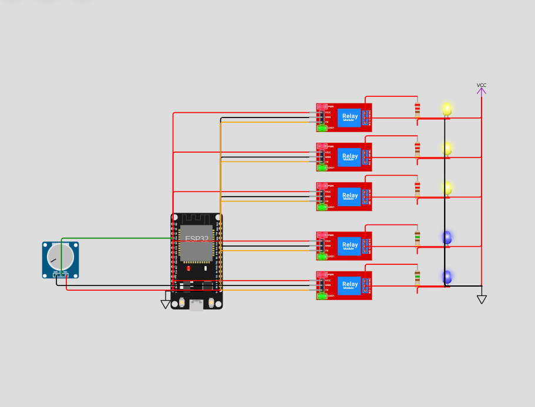

# Hardware / Electrical Schematic

This is a **concept-only** Wokwi circuit. It is not connected to the live
dashboard or Discord bot in any way — those run entirely on simulated data in
Convex (see the main [README](../../README.md)). This schematic exists purely
to answer the requirement: *"if this office actually had smart-controlled
lights and fans, how would you wire and sense them?"*

Open it directly here: **[Wokwi project](https://wokwi.com/projects/468597321072296961)**
(or open `diagram.json` + `sketch.ino` from this folder in your own Wokwi
project — same files).

## What it models

One representative room — **Work Room 1** (3 lights + 2 fans) — out of the
office's 15 devices. The same pattern repeats for the other two rooms; wiring
18 relays would just be repetition of this unit, so one room is shown in full.

```
ESP32 (controller)
 ├─ GPIO 22 ──▶ Relay 1 IN ──▶ Relay 1 COM/NO ──▶ Light 1 (mains wire in real life)
 ├─ GPIO 23 ──▶ Relay 2 IN ──▶ Relay 2 COM/NO ──▶ Light 2
 ├─ GPIO 18 ──▶ Relay 3 IN ──▶ Relay 3 COM/NO ──▶ Light 3
 ├─ GPIO 19 ──▶ Relay 4 IN ──▶ Relay 4 COM/NO ──▶ Fan 1
 ├─ GPIO 21 ──▶ Relay 5 IN ──▶ Relay 5 COM/NO ──▶ Fan 2
 └─ GPIO 34 (ADC) ◀── current-sense tap (potentiometer stands in for an ACS712)
```

- **Relays switch the device, they don't power it.** COM/NO in the diagram is
  wired to an LED+resistor pair (yellow = light, blue = fan) just so the
  simulation is visible in Wokwi. In real hardware, COM/NO would sit in series
  with the device's actual live (mains) conductor, not an LED.
- **Relay coil side runs on 5V (ESP32 `VIN`)**, not 3.3V — that's what a real
  5V relay module (e.g. SRD-05VDC-SL-C) needs to reliably energize its coil.
  The GPIO only drives the low-current `IN` logic pin.
- **Relay trigger is active-LOW**, which is standard for these boards: pulling
  `IN` LOW energizes the relay (device ON, via `NO`); `IN` HIGH or floating
  leaves it de-energized (device OFF, via `NC`). The sketch's `RELAY_ON` /
  `RELAY_OFF` constants encode this so the logic matches real relay hardware
  instead of fighting it.
- **Current sensing** is represented with a potentiometer feeding an ADC pin,
  standing in for an ACS712 current sensor (Wokwi has no built-in ACS712
  part). In a real build, the ESP32 would read this to cross-check "5 devices
  on → expect ~X watts" against what's actually being drawn, and flag a
  mismatch (e.g. a stuck relay).

## Why this is separate from the rest of the project

The project's actual device data — the 15 devices, their on/off state, watts,
and timestamps — comes entirely from the Convex simulator described in the
main README. Nothing here talks to Convex, the dashboard, or the bot. This
folder only proves the wiring approach would work if the office's lights and
fans were ever hooked up to real relays and an ESP32.

## Safety note

`COM`/`NO` on a real relay switches mains voltage (110/220V AC). Never touch
that side while powered; use enclosed, UL/CE-rated relay modules and
appropriately rated wire gauge. The ESP32 side of the circuit stays at
3.3V/5V logic the entire time.